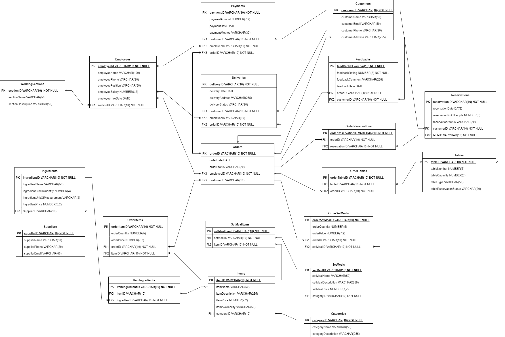
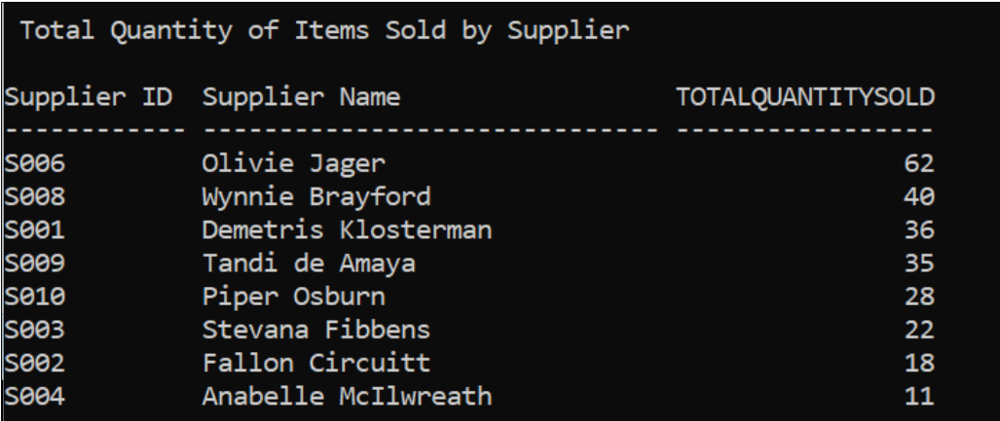
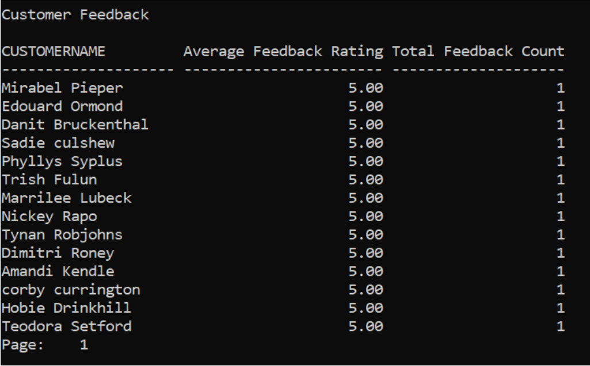
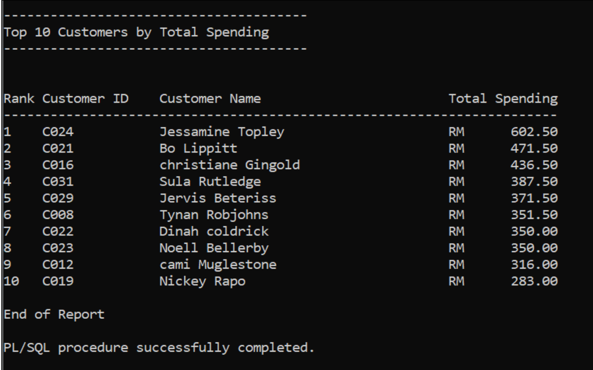
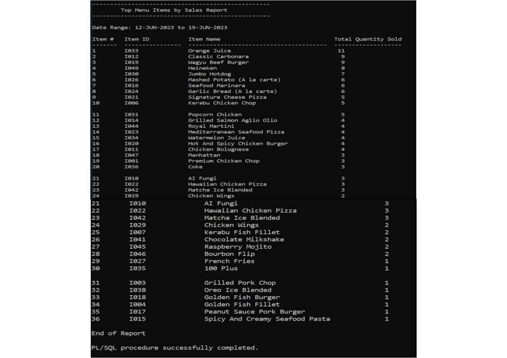

# WesternFoodRestaurant_RDBMS

## Business Rules:
1. Each customer can place one or many orders, and each order will be placed by one and only one customer.
2. Each order can consist of one or many items, and each item can exist in one or many orders.
3. Reservation must be made at least one day before.
4. All transactions are not refundable after payment is made.
5. Check all item status; if found any “NOT AVAILABLE” items, check with the kitchen. If the item is available today, change the status to “AVAILABLE”; else, remain the same.
6. Each menu item must belong to a specific category.
7. All food items offered in the restaurant's menu must have at least one associated ingredient in the "ItemIngredient" entity.
8. Non-food items, such as beverages, are not required to have any specific ingredients associated with them.
9. Each set meal is composed of one or more individual food items.
10. A customer is not required to be associated with every order in the "Orders" entity. An order can exist without a specific customer being linked to it.
11. The system must accommodate orders placed by walk-in customers or anonymous guests who do not have registered customer accounts.
12. An order is not required to be associated with a specific table in the "Orders" entity. An order can exist without being linked to any particular table.
13. The system must handle scenarios where customers may place orders for take-out or delivery, and no specific table is involved.
14. A table can only be reserved for a specific date and time by one customer at a time.
15. The quantity of each order item must be a positive integer.
16. The total cost of an order should be calculated based on the sum of the prices of its order items.
17. Each supplier must be associated with the ingredients they supply.
18. Some deliveries, such as customer pickup orders or deliveries by external services, may not require an employee to make deliveries.

## Assumptions:
1. The restaurant operates within the specified business hours from 10.00 A.M. to 10.00 P.M. every day.
2. The restaurant maintains an inventory system to track the availability of menu items, and staff regularly update the item status based on kitchen feedback.
3. The staff has access to a Point of Sale (POS) system to handle order modifications before payment.
4. The restaurant follows a no-refund policy for all transactions after payments have been made.
5. Employees are divided into working sections to manage and allocate their responsibilities effectively.
6. The price of each menu item is recorded as a non-negative value in the system.
7. The total cost of the set meal is calculated based on the sum of the prices of its individual food items.
8. Customers are only allowed to provide feedback for the orders they have placed.
9. The reservation system ensures that customers can reserve a table only for a specific date and time, and each reservation is unique.
10. After customers have successfully made their reservation, the reservation status will be marked as ‘BOOKED’ or ‘COMPLETED’, if customers show up on the reservation date their reservation status will be marked as ‘ARRIVED’.
11. The number of people for reservations needs to match the table capacity for the available tables in the restaurant.

## Report

